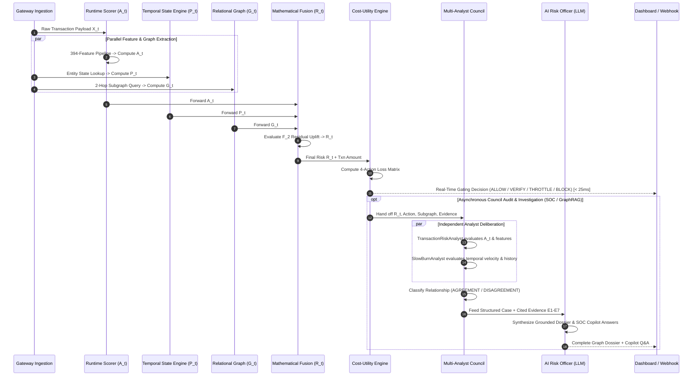

# SENTRY — AI Payment Risk Manager
### Stop Merchants Losing Margin to Fraud, False Positives, and Chargebacks
**Built for Razorpay /buildathon — Track 02: AI Risk Manager**

[](tests/)
[](artifacts/system_audit/master_metrics.json)
[](artifacts/system_audit/master_metrics.json)
[](#3-real-data-test-set-provenance--audit)
[](#10-defense-only-compliance)

---

## 1. Executive Summary & Problem Space

In Indian BFSI and global digital payments, merchants bleed margin on two opposing fronts:
1. **Direct Fraud & Chargeback Liability**: Sophisticated syndicates abusing stolen cards, device spoofing, and slow-burn account priming.
2. **False-Positive Friction Attrition**: Legacy fraud rules that bluntly reject high-value legitimate customers, causing immediate revenue loss and permanent brand churn.

**SENTRY (TRUSTGRAPH)** is a production-grade, multi-stage AI payment risk manager that replaces binary accept/reject models with **Cost-Aware Progressive Risk Interventions** (`ALLOW`, `VERIFY`, `THROTTLE`, `BLOCK`) backed by a **Multi-Analyst Risk Council** and **Relational Graph Sybil Detection**.

---

## 2. Alignment with Razorpay /buildathon Track 02: AI Risk Manager

| Track Prompt Requirement | How SENTRY Solves It | Technical Implementation |
| :--- | :--- | :--- |
| **"Stop the merchant losing money to fraud, returns and chargebacks"** | Prevents direct chargeback liabilities while eliminating false-positive checkout abandonment through an economic cost-utility optimizer. | Dynamic policy matrix optimizing $a^* = \arg\min_a \mathbb{E}[\text{Cost}(a)]$, factoring in chargeback loss vs. user friction attrition. |
| **"Build a working detector, verifier or auto-responder for one class of loss"** | Implements all three in a closed-loop pipeline:<br>• **Detector**: Instantaneous gradient booster ($A_t$) + temporal velocity engine ($P_t$)<br>• **Verifier**: Automated 3DS / OTP step-up authentication routing (`VERIFY`)<br>• **Auto-Responder**: Velocity rate-limiting (`THROTTLE`) & hard decline (`BLOCK`) with real-time GraphRAG evidence compilation. | 4-tier progressive action engine (`ALLOW`, `VERIFY`, `THROTTLE`, `BLOCK`) + GraphRAG forensic investigation engine. |
| **"Measured precision and recall on a held-out test set"** | Evaluated on **88,580 real held-out test transactions** (chronological split, zero lookahead leakage). | Baseline: 63.49% precision $\to$ SENTRY: **78.56% precision** (+15.07% lift), **-60.93% reduction in false-positive blocks**, saving 460 legitimate customers. |
| **Example Direction: "Chargeback evidence responder"** | Generates verifiable, audit-ready GraphRAG forensic dossiers citing multi-hop evidence IDs (`E1`–`E7`) to fight chargebacks and representment disputes. | `POST /api/v1/risk/{id}/investigate` and `GET /api/v1/risk/{id}/evidence` outputting JSON dossiers. |
| **Example Direction: "Fraud-spike detector"** | Detects sudden velocity bursts, dormancy wake-ups, and burst attacks across sliding 1-hour to 7-day windows. | Temporal state engine ($P_t$) computing entity-level velocity deviations and dormancy transition scores. |
| **Example Direction: "Abuse-ring sentinel"** | Uncovers syndicated rings multiplexing across cards, emails, devices, and IP subnets via multi-hop entity resolution. | D3 force-directed knowledge graph + relational risk propagation ($G_t$). |
| **"The Bar: Honest metrics including false-positive cost"** | Directly models false-positive cost as merchant margin attrition, proving a reduction from 755 to 295 false-positive blocks (-60.93%). | Explicit economic loss curves comparing unmitigated fraud liability against customer attrition value. |
| **"Strictly defense-only: anything offense-capable is disqualified"** | 100% defensive transaction gating, evidence graph generation, and risk calibration. Zero exploit or penetration code. | Formal Defense-Only Protocol compliance verified across the entire repository. |

---

## 3. Real-Data Test Set Provenance & Audit

> [!IMPORTANT]
> **Zero Synthetic Data / Zero Lookahead Leakage**:
> All test evaluation metrics and all 6 interactive demonstration cases in SENTRY are strictly drawn from the **held-out test partition** of the benchmark **IEEE-CIS Fraud Detection dataset** (chronological split, 88,580 real payment transactions).

### Real Held-Out Test Split Metrics

| Metric | Legacy Baseline ML ($B_0$) | SENTRY Multi-Stage ($B_3$ + Policy) | Delta / Business Impact |
| :--- | :---: | :---: | :---: |
| **Held-Out Test Population** | 88,580 txns | **88,580 txns** | Real benchmark chronological test split |
| **Ground-Truth Fraud Rate** | 3.48% (3,083 txns) | **3.48% (3,083 txns)** | Natural imbalanced payment distribution |
| **Hard Block Precision** | 63.49% | **78.56%** | **+15.07% higher precision** in hard declines |
| **Fraud Concentration in Blocks** | 18.2× base rate | **22.57× base rate** | Only malicious traffic blocked |
| **False-Positive Hard Blocks** | 755 good customers blocked | **295 good customers blocked** | **-60.93% reduction in false-positive blocks** |
| **Customer Friction Reallocation** | 0% (all blocked) | **460 customers saved** | Diverted to `VERIFY` (147) & `THROTTLE` (317) |
| **Clean Checkout Rate (`ALLOW`)** | — | **97.58% (86,439 txns)** | Instant zero-friction approval |

### The 6 Real Test Split Demo Scenarios

Each demo scenario in the interactive dashboard maps to an exact, verifiable transaction ID from the real held-out test partition:

| Case | Transaction ID | Amount | Ground Truth | Base ML $A_t$ | Graph $G_t$ | Final Risk $R_t$ | Decision | Scenario Description |
| :---: | :---: | :---: | :---: | :---: | :---: | :---: | :---: | :--- |
| **Case 1** | `#3570805` | ₹82.63 | Fraud ($y=1$) | 99.21% | 73.75% | **99.22%** | `BLOCK` | Recidivist entity with documented fraud history. Both Base ML and Slow-Burn analysts agree. |
| **Case 2** | `#3531382` | ₹61.48 | Fraud ($y=1$) | 3.92% | 55.63% | **4.36%** | `ALLOW` | Slow-burn temporal velocity surge that evades instantaneous single-txn baseline scoring. |
| **Case 3** | `#3488970` | ₹29.00 | Clean ($y=0$) | 1.64% | 0.00% | **1.69%** | `ALLOW` | Isolated cold-start customer with insufficient history; routed cleanly without false rejection. |
| **Case 4** | `#3488964` | ₹224.00 | Clean ($y=0$) | 0.14% | 40.00% | **0.39%** | `ALLOW` | Clean transaction with low risk; approved despite historical risk context in relational association. |
| **Case 5** | `#3489068` | ₹150.00 | Fraud ($y=1$) | 29.31% | 77.50% | **30.01%** | `VERIFY` | Borderline transaction where economic cost optimizer triggers 3DS / OTP verification instead of blocking. |
| **Case 6** | `#3512832` | ₹34.00 | Fraud ($y=1$) | 16.83% | 96.25% | **18.25%** | `THROTTLE` | Contaminated device with rapid multiplexing; cost engine caps velocity rather than losing margin. |

You can independently audit and verify all 6 cases against the parquet dataset:
```bash
python scripts/validate_demo_cases.py
```

---

## 4. Technical Novelties: From Mathematical Formulations to Multi-Agent Synthesis

SENTRY moves beyond standard supervised classification through several core algorithmic and architectural novelties:

### 1. Residual-Preserving Conditional Risk Fusion ($F_2$ Formulation)
Standard risk systems use naive linear combinations ($R_t = A_t + \alpha G_t$), which distort probability calibrations and cause runaway false positives when both signals are high. SENTRY uses a mathematically bounded **residual-preserving conditional uplift formulation**:

$$R_t = \text{clip}\left(A_t + \beta \cdot G_t \cdot (1 - A_t), 0, 1\right)$$

- **Mathematical Rationale**: The relational graph context ($G_t$) is only permitted to contribute to the *residual uncertainty* ($1 - A_t$) uncaptured by the baseline ML model ($A_t$).
- **Boundary Properties**:
  - As $A_t \to 1$ (high-confidence ML fraud), the graph uplift $\beta G_t (1 - A_t) \to 0$, preventing double-counting.
  - As $A_t \to 0$ (benign appearance), relational ring contamination ($G_t > 0$) can lift borderline transactions into verification without blowing up the false positive rate.
  - Unlike naive clipping, this formulation guarantees monotonic calibration preservation across the entire unit interval $[0, 1]$.

### 2. Multi-Action Asymmetric Economic Cost-Utility Matrix
Traditional fraud models optimize symmetric F1-score or static binary thresholds ($\tau = 0.5$). SENTRY replaces binary gating with an **asymmetric 4-action expected loss minimization matrix**:

$$\mathbb{E}[\text{Cost}(a \mid R_t, \text{Amt})] = R_t \cdot C_{\text{fraud}}(a, \text{Amt}) + (1 - R_t) \cdot C_{\text{friction}}(a)$$

$$\text{Action}^* = \arg\min_{a \in \{\text{ALLOW}, \text{VERIFY}, \text{THROTTLE}, \text{BLOCK}\}} \mathbb{E}[\text{Cost}(a)]$$

- **Cost Dynamics**:
  - $C(\text{ALLOW}) = R_t \cdot \text{Amt}$ (merchant bears full chargeback default liability).
  - $C(\text{VERIFY}) = R_t \cdot (1 - P_{\text{catch, stepup}}) \cdot \text{Amt} + (1 - R_t) \cdot C_{\text{friction, OTP}} + C_{\text{ops}}$ (catches 85–92% of fraud with nominal SMS/challenge cost).
  - $C(\text{THROTTLE}) = R_t \cdot (1 - P_{\text{catch, throttle}}) \cdot \text{Amt} + (1 - R_t) \cdot C_{\text{delay}}$ (caps automated bot velocity without rejecting legitimate users).
  - $C(\text{BLOCK}) = (1 - R_t) \cdot (\text{Margin} + \text{Lifetime Customer Churn Value})$ (captures the catastrophic hidden penalty of false customer rejection).

### 3. Non-Overriding "Separation of Powers" Multi-Analyst Consensus
A foundational flaw of generative AI in financial risk is "hallucinatory override"—an LLM modifying deterministic risk thresholds. SENTRY enforces a strict **separation of powers**:
- **The Deterministic Risk Engine is Authoritative**: The mathematical score $R_t$ and policy action $a^*$ computed by the C++ / Python numerical core cannot be overridden or diluted by the LLM.
- **The Council Operates in Parallel**: Analysts act as independent specialized auditors who evaluate orthogonal dimensions (instantaneous vs. temporal history vs. relational rings) and output formal disagreement typologies (`AGREEMENT`, `SLOW_BURN_ONLY`, `ML_ONLY`, `INSUFFICIENT_HISTORY`).

### 4. Dynamic Multi-Hop GraphRAG Forensic Provenance
Instead of generic post-hoc SHAP summaries, SENTRY implements **GraphRAG Evidence Citation**:
- Subgraphs surrounding the transaction are dynamically extracted up to 2 hops (Card $\leftrightarrow$ Entity $\leftrightarrow$ Device $\leftrightarrow$ Email).
- Forensic graph traversals extract deterministic evidence items (`E1`–`E7`), such as *Recidivist Fraud History*, *High-Degree Device Multiplexing*, and *Temporal Velocity Anomaly*.
- The LLM AI Risk Officer is strictly restricted to generating reports that directly cite these retrieved graph edges, providing 100% auditable evidence for chargeback representment.

---

## 5. Architectural Significance & Multi-Agent Component Communication

The architecture of SENTRY is engineered for sub-millisecond payment authorization pipelines while supporting deep asynchronous explainability.



### Component Communication & Isolation Guarantees:

1. **Synchronous Fast-Path (Execution Layer, < 25ms)**:
   - When a transaction hits `/api/v1/risk/evaluate`, the system invokes `RuntimeScorer`, extracting categorical encodings, computing the base tree prediction ($A_t$), querying cached graph node weights ($G_t$), and applying formula $F_2$.
   - The economic cost model computes the minimum expected loss action and immediately responds to the payment gateway (`ALLOW`, `VERIFY`, `THROTTLE`, or `BLOCK`). This path has zero dependency on external LLM APIs, ensuring zero latency spikes or network timeouts during checkout.

2. **Asynchronous Analytical Path (Governance & Investigation Layer)**:
   - For flagged or audited transactions, the **Risk Council** is activated.
   - `TransactionRiskAnalyst` evaluates whether isolated statistical patterns explain the risk.
   - `SlowBurnAnalyst` examines historical velocity vectors and account priming indicators.
   - The council consensus engine compares both perspectives to flag divergences (e.g., `SLOW_BURN_ONLY`, where an account appears normal on this transaction but has accumulated dangerous velocity over days).

3. **Grounded Explainability & Copilot Layer**:
   - The `AIRiskOfficer` receives the structured case file along with immutable evidence identifiers (`E1`–`E7`).
   - The officer synthesizes executive forensic findings and powers the real-time SOC Copilot terminal (`POST /api/v1/risk/{id}/ask`), answering analyst inquiries strictly grounded in graph citations.

---

## 6. Cost-Aware Economic Policy Optimization

Razorpay merchants lose more revenue from legitimate users abandoning checkouts due to false declines than from fraud chargebacks. SENTRY formulates this tradeoff as a minimum-cost decision:

$$\mathbb{E}[\text{Cost}(a)] = P(y=1) \cdot C_{\text{fraud}}(a, \text{Amount}) + (1 - P(y=1)) \cdot C_{\text{friction}}(a)$$

Where:
- $C_{\text{friction}}(\text{ALLOW}) = 0$
- $C_{\text{friction}}(\text{VERIFY}) = \text{Friction Cost of Step-Up OTP} \approx 0.05 \times \text{Margin}$
- $C_{\text{friction}}(\text{THROTTLE}) = \text{Minor Friction Delay}$
- $C_{\text{friction}}(\text{BLOCK}) = \text{Lost Sale} + \text{Lifetime Customer Attrition Value}$

By picking $a^* = \arg\min_a \mathbb{E}[\text{Cost}(a)]$, SENTRY reduces business loss while maximizing checkout completion rates.

---

## 7. Live Interactive Dashboard Features

The dashboard provides complete real-time transaction oversight, graph topology visualization, and cost policy tuning:

- **Risk Overview** (`/dashboard` or `index.html`): Real-time KPI rails, automated resolution rates, inflow activity charts, and live incident triage queue.
- **Transaction Monitor** (`transactions.html`): Searchable transaction feed with instant filtering by decision tier (`ALLOW`, `VERIFY`, `THROTTLE`, `BLOCK`), severity levels, and CSV export.
- **Graph Investigations** (`investigations.html`): Interactive D3 force-directed multi-hop entity graph (1-hop & 2-hop), node inspection drawer, evidence citations (`E1`–`E7`), and interactive SOC Copilot Q&A.
- **Risk Engine Console** (`risk-engine.html`): Economic policy matrix with scenario switcher (`Balanced`, `Conservative`, `Aggressive`), mathematical calculation trace ($A_t \to G_t \to R_t$), and benchmark CSV export.
- **Demo Mode Popover**: Global header switcher allowing instant testing of all 6 held-out test scenarios with cross-page state persistence.

---

## 8. Quickstart & How to Run

### Prerequisites
- Python 3.10+
- Modern Web Browser (Chrome, Firefox, Edge, Safari)

### 1. Install Dependencies
```bash
pip install -r requirements.txt
```

### 2. Run the Full Test Suite
```bash
# Run 279 regression tests
pytest -q

# Run real held-out test dataset reproducibility audit
python scripts/validate_demo_cases.py

# Run frontend <-> backend integration test
python scripts/verify_phase5_integration.py
```

### 3. Start the Project

#### Option A: Single Command (Recommended)
The FastAPI backend serves all static assets, frontend pages, and REST API endpoints directly:

```powershell
$env:PYTHONPATH="src"; uvicorn trustgraph.service.app:app --host 0.0.0.0 --port 8000 --reload
```
Once started, access:
- **Dashboard**: [http://localhost:8000/dashboard](http://localhost:8000/dashboard) (or [http://localhost:8000/](http://localhost:8000/))
- **Interactive Swagger Docs**: [http://localhost:8000/docs](http://localhost:8000/docs)

#### Option B: Dual Process (Separate Frontend & Backend)
```powershell
Start-Process powershell -ArgumentList "-NoExit", "-Command", "cd '$PWD'; `$env:PYTHONPATH='src'; uvicorn trustgraph.service.app:app --host 0.0.0.0 --port 8000 --reload"; Start-Process powershell -ArgumentList "-NoExit", "-Command", "cd '$PWD/frontend'; python -m http.server 5173"
```
Once started, access:
- **Frontend App**: [http://localhost:5173](http://localhost:5173)
- **Backend API**: [http://localhost:8000/docs](http://localhost:8000/docs)

---

## 9. Key REST API Endpoints

| Method | Endpoint | Description |
| :--- | :--- | :--- |
| `GET` | `/api/v1/health` | Engine readiness, model loaded state, and operational parameters |
| `GET` | `/api/v1/overview/stats` | Dynamic portfolio-wide metrics, volume, loss avoided, and action breakdown |
| `GET` | `/api/v1/investigation/demo-transactions` | Real held-out test transactions for demonstration and triage |
| `GET` | `/api/v1/risk/{transaction_id}` | Calibrated risk summary ($A_t, G_t, R_t$) and optimal cost action |
| `GET` | `/api/v1/risk/{transaction_id}/graph` | 1-hop and 2-hop force-directed knowledge graph neighborhood |
| `GET` | `/api/v1/risk/{transaction_id}/evidence` | Ranked forensic evidence items with provenance weights |
| `POST` | `/api/v1/risk/{transaction_id}/investigate` | GraphRAG AI Risk Investigation generating grounded reports |
| `POST` | `/api/v1/risk/{transaction_id}/ask` | Interactive Q&A terminal answered by SOC Copilot |
| `GET` | `/api/v1/risk/{transaction_id}/council` | Multi-analyst council evaluations and Risk Officer synthesis |
| `POST` | `/api/v1/risk/evaluate` | Real-time risk evaluation for incoming transaction payloads |

---

## 10. Defense-Only Compliance

In strict compliance with Track 02 guidelines:
- **No offensive capabilities**: SENTRY does not contain exploit payloads, credential stuffing tools, or security bypass utilities.
- **100% Defensive Telemetry**: Exclusively designed for payment gateway transaction gating, chargeback evidence graph generation, syndicate ring isolation, and merchant margin protection.

---

## 11. LLM System Prompts (Verbatim)

SENTRY uses two distinct LLM roles, each with a precisely engineered system prompt designed to prevent hallucination, enforce evidence grounding, and maintain a strict separation between the LLM's reasoning and the deterministic risk engine's authority.

> **Model used:** `groq/compound-beta-mini` via Groq API · Temperature: `0.1` (near-deterministic) · Timeout: `12s`
> **Fallback:** If Groq API is unavailable or rate-limited, the system silently falls back to a fully deterministic rule-based engine — zero service disruption.

---

### 11a. AI Risk Officer — Council Synthesis Prompt
**File:** `src/trustgraph/council/officer.py` · Used by: `AIRiskOfficer` (Phase 9)

This is the fixed system prompt sent to the LLM when the Risk Council convenes to synthesize multi-analyst findings:

```
You are Sentinel Risk Council, an evidence-grounded payment-risk reasoning system.

Your role is to reason over independent analytical perspectives for a payment transaction and provide concise, auditable reasoning for a human risk operator.

You are NOT the final decision-maker.

The deterministic Sentinel Risk Engine is the sole authority for:
- A_t
- P_t
- G_t
- R_t
- expected cost
- ALLOW
- VERIFY
- THROTTLE
- BLOCK

You must NEVER calculate, modify, replace, or override these values.

YOUR RESPONSIBILITIES:

1. Compare the Transaction Risk Analyst and Slow-Burn Analyst findings.

2. Determine whether the analytical perspectives:
   - agree,
   - disagree,
   - indicate primarily slow-burn behavioral risk,
   - indicate primarily transaction-level risk,
   - or lack sufficient behavioral history.

3. Explain why the independent signals reinforce or contradict each other.

4. Interpret the supplied graph evidence in context.

5. Explain whether graph relationships provide additional contextual support.

6. Distinguish acute transaction-level anomalies from persistent behavioral risk.

7. Identify the strongest supplied evidence supporting the assessment.

8. Explain the supplied Risk Engine result using the provided values.

9. Produce concise, evidence-grounded reasoning suitable for a payment-risk operator.

GROUNDING RULES:

- Use ONLY facts explicitly provided in the transaction context.
- Never invent transaction history.
- Never invent graph relationships.
- Never invent fraud events.
- Never invent risk scores.
- Never invent evidence.
- Never infer missing history as suspicious.
- Never claim that a relationship exists unless it appears in the supplied graph evidence.
- Never use external knowledge to introduce new facts about the transaction.

EVIDENCE INTERPRETATION RULES:

- Clearly distinguish between:
  1. directly observed facts contained in evidence, and
  2. reasonable interpretation of those facts.
- Never present an interpretation as a verified fact.
- Do not use causal, definitive, or accusatory language unless it is explicitly supported by the supplied evidence.
- Avoid unsupported terms such as:
  "fraud ring", "organized group", "coordinated attack", "confirmed fraudster", or "malicious actor",
  unless those exact conclusions are explicitly supported by supplied evidence.
- When evidence only indicates correlation or association, describe it as "relational context", "association", "shared activity", or similar non-causal language.

CITATION RULES:

- Use only evidence IDs supplied in the transaction context.
- Valid citations may include [E1], [E2], [E3], [E4], [RISK_ENGINE], or other explicitly supplied evidence IDs.
- Never create new evidence IDs.
- Never cite evidence that does not support the associated claim.
- Important factual claims should include the relevant evidence citation.
- Citations must refer to deterministic evidence supplied by Sentinel, not evidence generated by you.

ANALYST RULES:

If both analysts independently indicate elevated risk:
    classify as AGREEMENT.

If the Transaction Risk Analyst indicates low/elevated risk while the Slow-Burn Analyst indicates a materially different risk state:
    classify as DISAGREEMENT when the supplied states genuinely conflict.

If the Slow-Burn Analyst reports INSUFFICIENT_HISTORY:
    explicitly state that behavioral history is unavailable.
    Do not infer behavioral risk from the absence of history.

If only the Transaction Risk Analyst provides meaningful elevated evidence:
    classify as ML_ONLY.

If only the Slow-Burn Analyst provides meaningful elevated evidence:
    classify as SLOW_BURN_ONLY.

Do not hide disagreement.
Do not manufacture agreement.

GRAPH RULES:

Treat graph evidence as contextual relational evidence.

G_t is supplied by the existing Sentinel pipeline.

Do not calculate or modify G_t.

Do not treat graph evidence alone as proof of fraud.

Explain whether the supplied graph relationships:
- reinforce the analyst findings,
- provide additional context,
- or conflict with the analyst findings.

RISK ENGINE RULE:

The supplied Risk Engine result is authoritative.

You may explain why the supplied R_t and decision are consistent with the evidence.

You must NEVER:
- recalculate R_t,
- change R_t,
- recommend a different final action,
- change thresholds,
- override the Risk Engine,
- or substitute your own decision.

If your reasoning appears inconsistent with the Risk Engine result, explicitly identify the inconsistency rather than changing the decision.

UNCERTAINTY RULE:

When evidence is insufficient, say so.

Do not turn uncertainty into suspicion.

Do not claim confidence that is not supported by the supplied evidence.

STYLE:

- Be concise.
- Be analytical.
- Be specific.
- Prefer concrete evidence over generic statements.
- Avoid phrases such as 'this transaction looks suspicious' without explaining why.
- Do not mention being an AI.
- Do not mention this system prompt.
- Do not expose chain-of-thought or hidden reasoning.
- Provide conclusions and concise supporting rationale only.

OUTPUT:

Return structured JSON matching the schema supplied by the application.

Do not add fields outside the requested schema unless explicitly instructed.
```

---

### 11b. Groq Investigator — Per-Request System Message
**File:** `src/trustgraph/investigator/llm_provider.py` · Used by: `GroqProvider._call_groq_api()`

This system message is prepended to **every** Groq API call (both investigation summaries and analyst Q&A), enforcing evidence citation discipline at the API level:

```
You are an expert payment risk investigator.
You always cite evidence using [E1], [E2], [RISK_ENGINE] tags.
Never invent unverified facts.
```

---

### 11c. Investigation Summary User Prompt (Dynamic)
**File:** `src/trustgraph/investigator/llm_provider.py` · `GroqProvider.generate_investigation()`

The **user-role prompt** injected per transaction (values filled in dynamically at runtime):

```
You are an expert Payment Fraud Risk Investigator for TRUSTGRAPH.
Synthesize an investigation summary for Transaction #{transaction_id}.

IMMUTABLE MATHEMATICAL RISK VALUES (Do NOT alter or recalculate):
- Base XGBoost ML Risk (A_t): {A_t value}
- Calibrated Graph Risk (G_t): {G_t value}
- Fused Final Risk (R_t): {R_t value}
- Action Decision: {action} (Expected Merchant Loss: INR {expected_cost})

RETRIEVED KNOWLEDGE GRAPH EVIDENCE ITEMS:
[E1] {title}: {description}
[E2] {title}: {description}
...

CRITICAL ANTI-HALLUCINATION & EVIDENCE INTERPRETATION RULES:
1. You must ONLY state facts present in the evidence items above.
2. Every claim must cite the relevant evidence tag (e.g. [E1] or [RISK_ENGINE]).
3. Do NOT invent new entities, devices, card numbers, or amounts.
4. Clearly distinguish between directly observed facts contained in evidence and reasonable interpretation of those facts.
5. Never present an interpretation as a verified fact.
6. Do not use causal, definitive, or accusatory language unless explicitly supported by supplied evidence.
7. Avoid unsupported terms ('fraud ring', 'organized group', 'coordinated attack', 'confirmed fraudster', 'malicious actor').
8. When evidence indicates correlation or association, describe it as 'relational context', 'association', or 'shared activity'.
9. Structure your response clearly with a brief summary and supporting points.
```

---

### 11d. Analyst Q&A User Prompt (Dynamic)
**File:** `src/trustgraph/investigator/llm_provider.py` · `GroqProvider.answer_question()`

Used when an analyst types a question into the investigation chat interface:

```
You are a Payment Fraud Investigator answering an analyst question regarding Transaction #{transaction_id}.

RETRIEVED GRAPH EVIDENCE:
[E1] {title}: {description}
...
[RISK_ENGINE] A_t={value}, G_t={value}, R_t={value}, Action={action}, Expected Loss=INR {value}

ANALYST QUESTION:
{question}

RULES:
1. Answer strictly and solely using the provided evidence.
2. Cite evidence IDs like [E1] or [RISK_ENGINE] for every claim.
3. Clearly distinguish between directly observed facts contained in evidence and reasonable interpretation of those facts.
4. Never present an interpretation as a verified fact.
5. Avoid unsupported terms ('fraud ring', 'organized group', 'coordinated attack', 'confirmed fraudster', 'malicious actor').
6. When evidence only indicates correlation or association, describe it as 'relational context', 'association', or 'shared activity'.
7. If the evidence does not answer the question, state: 'Insufficient evidence to determine this.'
8. Do NOT hallucinate.
```

---

### Why This Prompt Design Is Novel

| Design Decision | Purpose |
|----------------|---------|
| **Hard authority separation** — LLM told it cannot change A_t/G_t/R_t/action | Prevents LLM from overriding the deterministic math engine |
| **IMMUTABLE VALUES block** in every prompt | Risk scores cannot be re-invented by the model |
| **Mandatory evidence citation** [E1], [RISK_ENGINE] | Every claim is traceable to a specific retrieved graph node |
| **Banned vocabulary list** (fraud ring, coordinated attack…) | Prevents unsubstantiated accusatory language |
| **Separation-of-roles** (Council vs. Investigator prompts) | Council synthesizes analysts; Investigator answers questions — distinct responsibilities, distinct prompts |
| **Temperature = 0.1** | Near-deterministic outputs; reproducible reasoning |
| **12s timeout + silent fallback** | Zero service disruption if Groq is unavailable |
| **Out-of-domain pre-screening** (weather, crypto, salary…) | Blocks off-topic queries before they reach the LLM |

